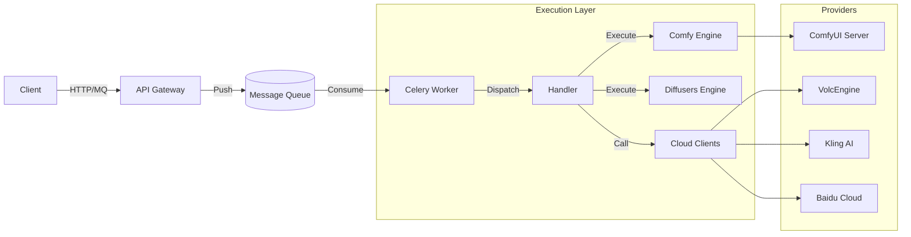

# GenPulse

<div align="center">

**Enterprise-Grade AI Generation Orchestration Engine**

[](LICENSE)
[](https://www.python.org/)
[](https://fastapi.tiangolo.com)
[](https://docs.celeryq.dev/)

[English](README.md) | [中文](README_ZH.md)

</div>

---

**GenPulse** is a comprehensive backend infrastructure designed to bridge the gap between complex Generative AI capabilities and business applications. It provides a unified, coherent interface to orchestrate tasks across multiple cloud providers (SaaS) and local execution engines (PaaS/IaaS).

## ✨ Key Features

### 🔌 Multi-Provider Support
Unified abstraction layer for various top-tier AI providers. Switch providers instantly without changing your client code.
*   **Video Generation**: VolcEngine (PixelDance), Kling AI, MiniMax (Hailuo), Baidu (UniVid), Tencent (Hunyuan), DashScope (Wanx).
*   **Image Generation**: VolcEngine, DashScope (Wanx), Baidu (SDXL), Tencent, MiniMax.

### 🎨 Deep ComfyUI Integration
Treats ComfyUI as a robust execution backend engine.
*   **Template System**: Call complex workflows using simple JSON templates (`src/genpulse/templates`).
*   **ComfyEngine**: Dedicated engine handles WebSocket communication, queue management, and parameter injection.
*   **Performance**: Supports `SaveImageWebsocket` for zero-latency image retrieval (no disk I/O).

### ⚡ Unified Architecture
*   **Handlers & Engines**: Clear separation between Business Dispatchers (Handlers) and Execution Logic (Engines).
*   **RabbitMQ / Redis MQ**: High-concurrency task queue based on Celery.
*   **Unified Storage**: Auto-upload generated assets to S3/OSS/MinIO and return standardized URLs.

### 🛠 Developer Experience
*   **FastAPI**: Modern, async, typed Python framework.
*   **DevOps Ready**: One-click `docker-compose` deployment with PostgreSQL, Redis, and Flower.
*   **Admin Dashboard**: Built-in SQLAdmin for visual task management.

## 🚀 Quick Start

### 1. Using Docker (Recommended)

```bash
# Clone repository
git clone https://github.com/isWangjianhua/GenPulse.git
cd GenPulse

# Configure Environment
cp .env.example .env
# Edit .env to set your API KEYS (VOLC_ACCESS_KEY, KLING_AK, etc.)

# Launch Stack
docker-compose up -d

# Access Services
# - API Docs:      http://localhost:8000/docs
# - Admin Panel:   http://localhost:8000/admin
# - Worker Monitor: http://localhost:5555
```

### 2. Local Development

```bash
# Install dependencies using uv
uv sync

# Run Development Server
# Starts API, Worker, and Flower automatically
uv run genpulse dev
```

## 📚 Documentation

Detailed documentation is available in [English](docs/en/) and [Chinese](docs/zh/).

*   [**Architecture Design**](docs/en/architecture_design.md): Understand the core concepts (Handlers, Engines, Clients).
*   [**API Reference**](docs/en/api.md): Detailed API endpoints and parameter specs.
*   [**Deployment Guide**](docs/en/deploy.md): How to deploy to production.


## 🧩 System Architecture

GenPulse adopts a Layered Architecture to decouple business logic from AI implementation details.



## 🤝 Contributing

Contributions are welcome! Please check the [Contributing Guide](docs/en/dev/contributing.md) (Coming Soon).

## 📄 License

This project is licensed under the MIT License - see the [LICENSE](LICENSE) file for details.
