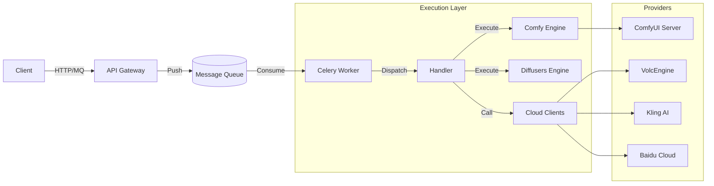

# GenPulse

<div align="center">

**企业级生成式 AI 编排引擎 (Enterprise-Grade AI Generation Orchestration Engine)**

[](LICENSE)
[](https://www.python.org/)
[](https://fastapi.tiangolo.com)
[](https://docs.celeryq.dev/)

[English](README.md) | [中文](README_ZH.md)

</div>

---

**GenPulse** 是一个功能全面的后端基础设施，旨在弥合复杂的生成式 AI 能力与业务应用之间的鸿沟。它提供了一个统一、连贯的接口，用于编排跨多个云提供商（SaaS）和本地执行引擎（PaaS/IaaS）的任务。

## ✨ 核心特性

### 🔌 多供应商支持 (Multi-Provider)
为顶级 AI 提供商提供统一的抽象层。无需更改客户端代码即可立即切换供应商。
*   **视频生成**: 火山引擎 (PixelDance), 快手可灵 (Kling AI), MiniMax (Hailuo), 百度文心 (UniVid), 腾讯混元 (Hunyuan), 阿里通义万相 (Wanx)。
*   **图像生成**: 火山引擎, 通义万相, 百度文心 (SDXL), 腾讯混元, MiniMax。

### 🎨 深度 ComfyUI 集成
将 ComfyUI 视为核心的执行后端引擎。
*   **模板系统**: 通过简单的 JSON 模板调用复杂的工作流 (`src/genpulse/templates`)。
*   **ComfyEngine**: 专用引擎负责 WebSocket 通信、队列管理和参数注入。
*   **高性能**: 支持 `SaveImageWebsocket`，实现零延迟图像检索（无需磁盘 I/O）。

### ⚡ 统一架构
*   **Handlers & Engines**: 业务调度器 (Handlers) 和执行逻辑 (Engines) 职责明确分离。
*   **RabbitMQ / Redis MQ**: 基于 Celery 的高并发任务队列。
*   **统一存储 (Unified Storage)**: 自动上传生成的资产到 S3/OSS/MinIO 并返回标准化 URL。

### 🛠 开发者体验
*   **FastAPI**: 现代、异步、类型安全的 Python 框架。
*   **DevOps Ready**: 一键 `docker-compose` 部署，包含 PostgreSQL, Redis 和 Flower。
*   **管理后台**: 内置 SQLAdmin，可视化管理任务数据。

## 🚀 快速开始

### 1. 使用 Docker (推荐)

```bash
# 克隆仓库
git clone https://github.com/isWangjianhua/GenPulse.git
cd GenPulse

# 配置环境
cp .env.example .env
# 编辑 .env 设置您的 API KEYS (VOLC_ACCESS_KEY, KLING_AK, etc.)

# 启动服务栈
docker-compose up -d

# 访问服务
# - API 文档:      http://localhost:8000/docs
# - 管理后台:      http://localhost:8000/admin
# - 任务监控:      http://localhost:5555
```

### 2. 本地开发

```bash
# 使用 uv 安装依赖
uv sync

# 运行开发服务器
# 会自动启动 API, Worker, 和 Flower
uv run genpulse dev
```

## 📚 文档

详细文档请参阅 [英文文档](docs/en/) 和 [中文文档](docs/zh/)。

*   [**架构设计**](docs/zh/architecture_design.md): 理解核心可概念 (Handlers, Engines, Clients)。
*   [**API 参考**](docs/en/api.md): 详细的 API 端点和参数说明 (英文)。
*   [**部署指南**](docs/en/deploy.md): 生产环境部署指南 (英文)。
*   [**Java 集成**](docs/en/dev/java_integration.md): Java 客户端开发指南 (英文)。

## 🧩 系统架构

GenPulse 采用分层架构，将业务逻辑与 AI 实现细节解耦。



## 🤝 贡献

欢迎贡献代码！请查看 [贡献指南](docs/en/dev/contributing.md) (即将推出)。

## 📄 许可证

本项目采用 MIT 许可证 - 详情请见 [LICENSE](LICENSE) 文件。
