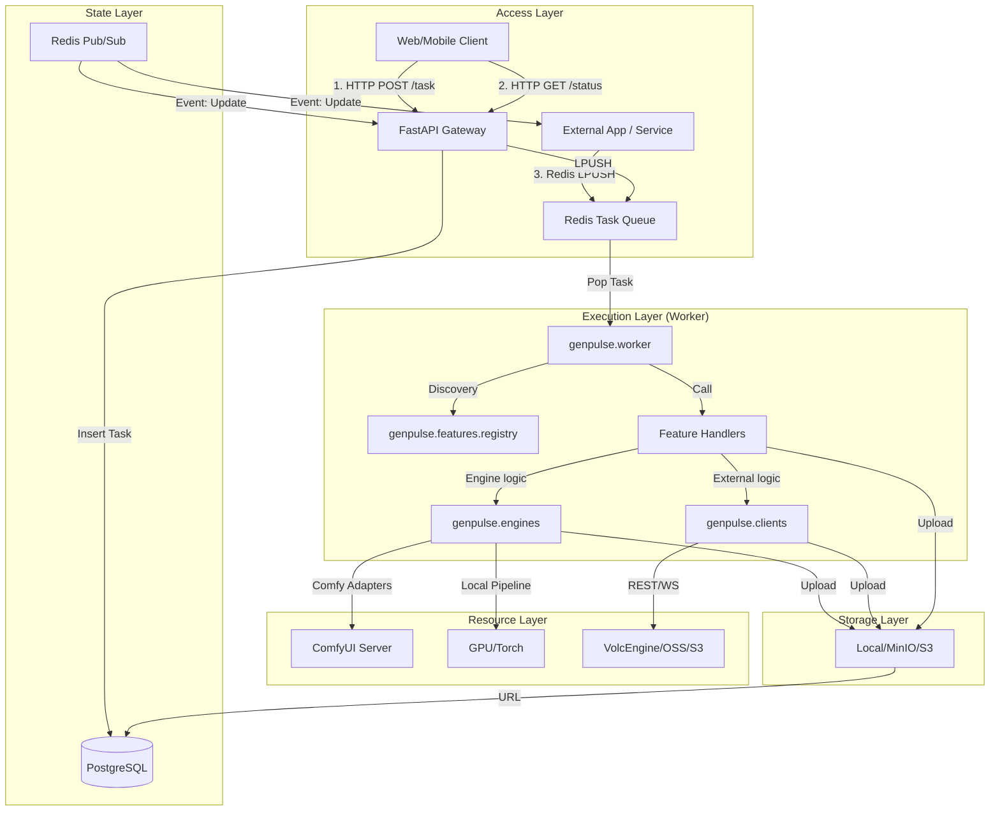

# GenPulse Backend Architecture Design

## 1. System Architecture Overview

GenPulse is a high-concurrency generative AI backend system supporting multi-modality (Image/Video) and multiple execution engines (ComfyUI/Diffusers/API). It adopts a **Hybrid Ingestion Architecture**, supporting both standard HTTP Polling and high-performance Direct MQ interaction.

### Core Features
- **Plugin-based Architecture**: Adopts a Registry Pattern where the core system is agnostic to specific business logic. Adding new capabilities (e.g., TTS) only requires adding a single Handler file without modifying the core.
- **Hybrid Communication**: Supports both **HTTP+Polling** (immediate response + status check) and **Redis MQ** (direct message queue connection) for ingestion.
- **Unified Execution Abstraction**: Defines a standard `BaseHandler` interface. Whether it's local model inference, ComfyUI forwarding, or external API calls, everything is encapsulated as a unified execution unit.
- **State Management**: Uses PostgreSQL for persistence and Redis for real-time state and message bus.
- **Storage Strategy**: Object Storage (OSS/S3) hosts generated assets, supporting temporary links and CDN acceleration.

## 2. System Topology



## 3. Detailed Design

### 3.1 The Core: Feature-Engine Architecture

To enable "extension without modification," the system uses a **Registry Pattern** organized into three layers.

**Directory Structure:**
```
src/genpulse/
  ├── app.py           # FastAPI Application Factory & Gateway
  ├── worker.py        # Generic Task Worker (Consumer)
  ├── features/        # Business Domain Logic (The "What")
  │   ├── base.py      # BaseHandler Interface
  │   ├── registry.py  # Task-to-Handler Mapping
  │   ├── image/       # Image Gen Features (text-to-image, etc)
  │   └── video/       # Video Gen Features
  ├── engines/         # Technical Implementations (The "How")
  │   ├── comfy_engine.py    # ComfyUI Integration
  │   └── diffusers_engine.py # Local Diffusers Integration
  ├── infra/           # Shared Infrastructure
  │   ├── database/    # PostgreSQL / SQLAlchemy
  │   └── mq/          # Redis Message Queue
  └── clients/         # External API Wrappers (The "Remote")
      ├── volcengine/  # ByteDance VolcEngine Client
      └── comfyui/     # ComfyUI WebSocket/HTTP Client
```

**BaseHandler Interface:**
```python
class BaseHandler(ABC):
    @abstractmethod
    def validate_params(self, params: Dict[str, Any]) -> bool:
        """Validate task parameters"""
        pass

    @abstractmethod
    async def execute(self, task: Dict[str, Any], context: Dict[str, Any]) -> Dict[str, Any]:
        """
        Core execution logic.
        Context provides generic capabilities like `update_status()`.
        """
        pass
```

### 3.2 Unified Task Model

Task types are no longer tied to specific implementations but represent "What" the user wants to do. The "How" is specified via a `provider` inside `params`.

```json
{
  "task_id": "uuid-v4",
  "task_type": "text-to-image",
  "priority": "normal",
  "params": {
    "provider": "comfyui",
    "prompt": "a cyberpunk city",
    "workflow": { ... }
  }
}
```

The Worker uses the `task_type` to find a feature handler, which then inspects the `provider` to decide which engine or client to use.

### 3.3 Generic Worker Logic

The Worker contains no domain-specific logic; it merely acts as a bridge:

1.  Pop task from Redis.
2.  Read `task_type`.
3.  Get corresponding `FeatureHandler` from `genpulse.features.registry`.
4.  Instantiate and call `await handler.execute(task, context)`.
5.  Feature handler delegates to `engines` or `clients`.
6.  Capture return value or exception, update Redis/DB.

### 3.4 Extension Scenarios

-   **Scenario: Adding Voice Generation**
    1.  Create `src/genpulse/features/voice/handlers.py`.
    2.  Implement `BaseHandler`, calling a TTS engine from `engines/`.
    3.  Add decorator `@registry.register("text-to-speech")`.
    4.  **Done**. API automatically supports `task_type="text-to-speech"`.

-   **Scenario: Adding specialized Image generation**
    1.  Add logic to `src/genpulse/features/image/handlers.py` or create a new file.
    2.  Use the `provider` pattern to switch between internal engines.
    3.  Register new task types as needed.

### 3.5 Communication / Data Flow

#### Method A: HTTP (For End Users)
1.  **Submit**: `POST /task` -> Return `{ "status": "pending", "task_id": "xyz", ... }`.
2.  **Process**: Backend processes asynchronously, updates Redis (MQ) and PostgreSQL (DB).
3.  **Poll**: Client `GET /task/xyz` -> Return `{ "status": "processing", "progress": 50 }`.
4.  **Complete**: Return `{ "status": "completed", "result": { "images": [...] } }`.

#### Method B: Direct MQ (For Power Users / Integration)
1.  **Submit**: Client sends JSON to Redis `tasks:pending` list via `LPUSH`.
2.  **Process**: Same as above.
3.  **Listen**: Client `SUBSCRIBE task_updates:{task_id}` channel to receive real-time JSON events for progress/results.

### 3.6 Storage Strategy

-   **Object Storage (MinIO/S3)**:
    -   Path Schema: `/YYYY/MM/DD/{user_id}/{task_id}.png` (or .mp4)
    -   Lifecycle: Default long-term storage, configurable TTL.
-   **Database (PostgreSQL)**:
    -   `tasks` table: Stores task metadata, status, parameters, result URLs, duration, and billing records.

### 3.7 Service Orchestration & Startup Strategy

The system is managed via the `genpulse` CLI (defined in `pyproject.toml` pointing to `genpulse.cli`).

#### A. Development (Dev Mode)
Command: `uv run genpulse dev`
- **Behavior**: Starts both the FastAPI Server and the Task Worker in the same terminal/event loop.
- **Workflow**: Ideal for local testing where you want to see both API logs and Worker logs together.

#### B. Production (Separated Mode)
Run as separate services:
1. **API**: `uv run genpulse api`
2. **Worker**: `uv run genpulse worker`

This allows scaling the Worker independently from the API. The API only needs to handle I/O and DB/Redis fast transactions, while Workers handle CPU/GPU intensive tasks.

#### C. Local Engines
For engines like ComfyUI, you can:
- Run them manually as separate processes.
- The `FeatureHandler` connects to them via `server_address` (defaulting to `localhost:8188`).

## 4. Technology Stack

| Component | Choice | Reason |
| :--- | :--- | :--- |
| **Language** | Python 3.10+ | AI ecosystem standard, excellent Type Hint support |
| **Web Framework** | **FastAPI** | High-performance async, native OpenAPI support |
| **Queue / Broker** | **Redis** | Ultra-low latency, supports Pub/Sub & Lists, ideal for real-time AI tasks |
| **Database** | **PostgreSQL** | Robust relational storage, supports JSONB |
| **ORM** | **SQLAlchemy(Async)** | Modern asynchronous ORM |
| **Storage** | **MinIO (S3 Compatible)** | Self-hosted object storage, AWS S3 protocol compatible |
| **AI Inference** | **Diffusers** / **ComfyUI** | Industry standard inference libraries |
