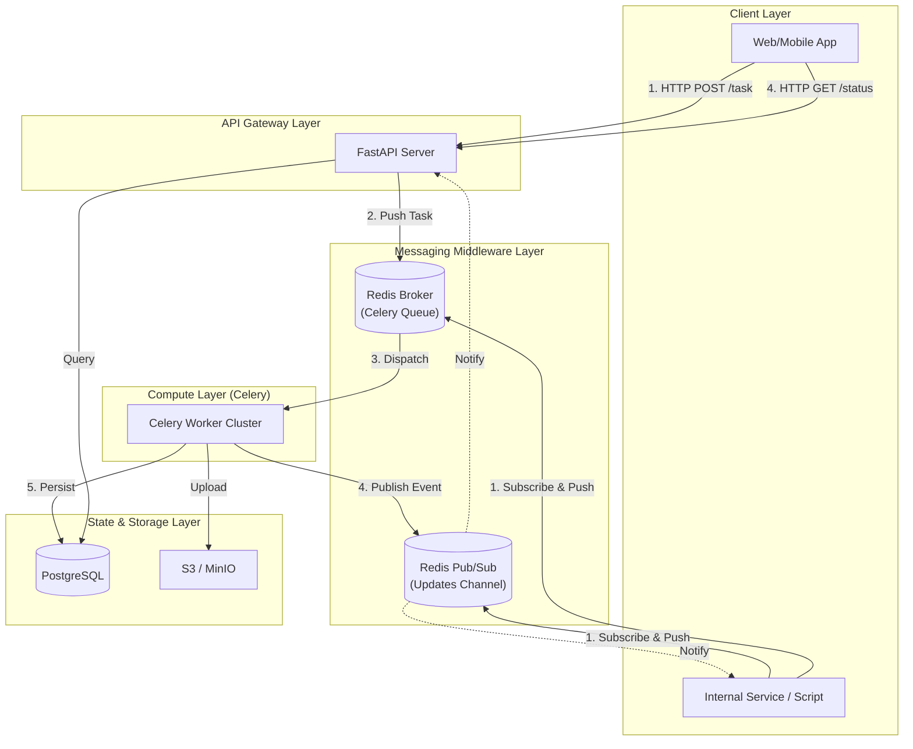

# GenPulse Backend Architecture Design

## 1. System Architecture Overview

GenPulse is a high-concurrency generative AI backend system supporting multi-modality (Image/Video) and multiple execution engines (ComfyUI/Diffusers/API). It adopts a **Hybrid Ingestion Architecture**, supporting both standard HTTP Polling and high-performance Direct MQ interaction.

### Core Features
- **Plugin-based Architecture**: Adopts a Registry Pattern where the core system is agnostic to specific business logic. Adding new capabilities (e.g., TTS) only requires adding a single Handler file without modifying the core.
- **Hybrid Communication**: Supports both **HTTP+Polling** (immediate response + status check) and **Redis MQ** (direct message queue connection) for ingestion.
- **Unified Execution Abstraction**: Defines a standard `BaseHandler` interface. Whether it's local model inference, ComfyUI forwarding, or external API calls (e.g., VolcEngine, Kling), everything is encapsulated as a unified execution unit.
- **State Management**: Uses PostgreSQL for persistence and Redis for real-time state and message bus.
- **Storage Strategy**: Object Storage (OSS/S3) hosts generated assets, supporting temporary links and CDN acceleration.

## 2. System Topology



## 3. Detailed Design

### 3.1 The Core: Handler-Client Architecture

To enable "extension without modification," the system uses a **Registry Pattern** organized into clear layers.

**Directory Structure:**
```
src/genpulse/
  ├── app.py           # FastAPI Application Factory & Gateway
  ├── worker.py        # Generic Task Worker (Consumer)
  ├── handlers/        # Business Domain Logic (The "What")
  │   ├── base.py      # BaseHandler Interface
  │   ├── registry.py  # Task-to-Handler Mapping
  │   ├── image.py     # Image Gen Logic
  │   └── video.py     # Video Gen Logic
  ├── clients/         # External API Wrappers (The "Remote")
  │   ├── base.py      # BaseClient (Polling/HTTP utils)
  │   ├── volcengine/  # ByteDance VolcEngine Client
  │   ├── tencent/     # Tencent Cloud Client
  │   ├── baidu/       # Baidu Cloud Client
  │   ├── kling/       # Kling AI Client
  │   └── ...          # More providers
  ├── engines/         # Local/Technical Implementations (The "How")
  │   ├── comfy_engine.py    # ComfyUI Integration
  │   └── diffusers_engine.py # Local Diffusers Integration
  ├── infra/           # Shared Infrastructure
  │   ├── database/    # PostgreSQL / SQLAlchemy
  │   └── mq/          # Message Queue Abstraction (RedisMQ)
```

**BaseHandler Interface:**
```python
class BaseHandler(ABC):
    @abstractmethod
    def validate_params(self, params: Dict[str, Any]) -> bool:
        """Validate task parameters"""
        pass

    @abstractmethod
    async def execute(self, task: Dict[str, Any], context: TaskContext) -> Dict[str, Any]:
        """
        Core execution logic.
        Context provides strongly-typed capabilities like `context.set_processing()`.
        """
        pass
```

### 3.2 Unified Task Model & Context

Task types are no longer tied to specific implementations but represent "What" the user wants to do. The "How" is specified via a `provider` inside `params`.

**TaskContext**:
Instead of passing raw dictionaries, we use a `TaskContext` object to ensure type safety and consistent status updates.

```python
@dataclass
class TaskContext:
    task_id: str
    update_status: Callable[...] 
    
    async def set_processing(self, progress: int, info: str = None): ...
    async def set_failed(self, error: str): ...
```

### 3.3 Generic Worker Logic

The Worker contains no domain-specific logic; it merely acts as a bridge:

1.  Pop task from MQ (via `genpulse.infra.mq`).
2.  Read `task_type`.
3.  Get corresponding `FeatureHandler` from `genpulse.handlers.registry`.
4.  Instantiate and call `await handler.execute(task, context)`.
5.  Feature handler delegates to `engines` or `clients`.
6.  Capture return value or exception, update MQ/DB.

### 3.4 Extension Scenarios

-   **Scenario: Adding a New Cloud Provider (e.g., Sora)**
    1.  Create `src/genpulse/clients/sora/`.
    2.  Implement `SoraClient` inheriting from `BaseClient`.
    3.  Define schemas in `schemas.py`.
    4.  Update `src/genpulse/handlers/video.py` to route `provider="sora"` to your new client.
    5.  **Done**.

-   **Scenario: Adding a New Task Type (e.g., Text-to-Audio)**
    1.  Create `src/genpulse/handlers/audio.py`.
    2.  Implement `BaseHandler`.
    3.  Add decorator `@registry.register("text-to-audio")`.
    4.  **Done**. API automatically supports `task_type="text-to-audio"`.

### 3.5 Dual-Mode Ingestion

GenPulse supports two distinct interaction models to serve different user needs, both sharing the same underlying GPU infrastructure:

**Mode A: HTTP + Polling (The "Waiter" Model)**
- **Target**: Public Web Apps, Mobile Apps, Frontends.
- **Flow**: User POSTs a task -> API returns ID immediately -> User Polls ID -> API checks Redis/DB.
- **Pros**: Non-blocking for clients, robust against unstable networks, standard REST API.

**Mode B: RPC Microservice (The "Direct" Model)**
- **Target**: Internal Scripts, Microservices, CI/CD Pipelines.
- **Flow**: Service calls `mq.send_task_wait()` -> SDK connects to Redis -> Pushes Task -> Subscribes to result channel -> Blocks until done.
- **Pros**: Synchronous-like developer experience ("Call function, get result"), higher throughput for internal traffic, no polling latency.

**Shared Infrastructure**:
Both modes submit tasks to the **same Celery Queue**. The Worker cluster does not distinguish the source; it simply processes tasks and broadcasts events. This allows maximizing resource utilization across different traffic types.

### 3.6 Error Handling Strategy

1.  **Detection**: Clients/Engines raise exceptions (wrapped or standard).
2.  **Capture**: The Worker wraps the entire execution block in a robust `try/except`.
3.  **Reporting**: On catching an exception, the Worker automatically:
    -   Logs the full stack trace with `loguru`.
    -   Updates MQ/DB status to `FAILED`.
    -   Propagates the error message.

## 4. Technology Stack

| Component | Choice | Reason |
| :--- | :--- | :--- |
| **Language** | Python 3.10+ | AI ecosystem standard, excellent Type Hint support |
| **Web Framework** | **FastAPI** | High-performance async, native OpenAPI support |
| **Queue / Broker** | **Celery** (over Redis) | Robust distributed task queue with ACK assurance |
| **MQ Abstraction** | **CeleryMQ** | RPC-capable wrapper for Celery & Redis Pub/Sub |
| **Database** | **PostgreSQL** | Robust relational storage, supports JSONB |
| **ORM** | **SQLAlchemy(Async)** | Modern asynchronous ORM |
| **HTTP Client** | **HTTPX** | Fully async HTTP client for external API calls |
| **Validation** | **Pydantic V2** | Robust data validation and settings management |
| **AI Inference** | **Diffusers** / **ComfyUI** | Industry standard inference libraries |
