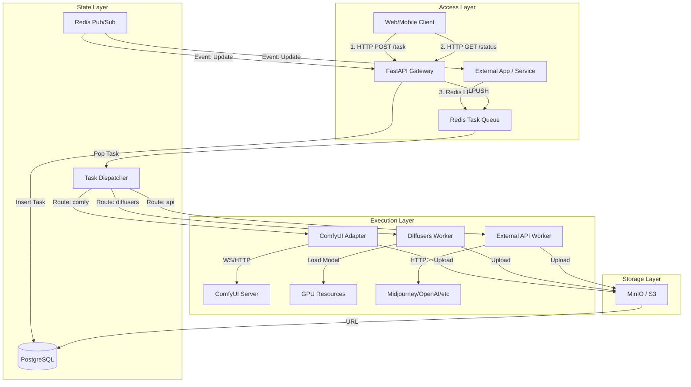

# GenPulse Backend Architecture Design

## 1. System Architecture Overview

GenPulse is a high-concurrency generative AI backend system supporting multi-modality (Image/Video) and multiple execution engines (ComfyUI/Diffusers/API). It adopts a **Hybrid Ingestion Architecture**, supporting both standard HTTP Polling and high-performance Direct MQ interaction.

### Core Features
- **Plugin-based Architecture**: Adopts a Registry Pattern where the core system is agnostic to specific business logic. Adding new capabilities (e.g., TTS) only requires adding a single Handler file without modifying the core.
- **Hybrid Communication**: Supports both **HTTP+Polling** (immediate response + status check) and **Redis MQ** (direct message queue connection) for ingestion.
- **Unified Execution Abstraction**: Defines a standard `BaseHandler` interface. Whether it's local model inference, ComfyUI forwarding, or external API calls, everything is encapsulated as a unified execution unit.
- **State Management**: Uses PostgreSQL for persistence and Redis for real-time state and message bus.
- **Storage Strategy**: Object Storage (OSS/S3) hosts generated assets, supporting temporary links and CDN acceleration.

## 2. System Topology



## 3. Detailed Design

### 3.1 The Core: Registry Pattern

To enable "extension without modification," the system uses a **Dynamic Registry Pattern**.

**Directory Structure Example:**
```
core/                # System Backbone (Stable)
  ├── gateway.py     # HTTP Ingestion
  ├── mq.py          # Redis Queue Management
  └── worker.py      # Generic Task Executor
handlers/            # Business Plugins (Extensible)
  ├── __init__.py    # Auto-discovery
  ├── base.py        # BaseHandler Interface Definition
  ├── z_image.py     # Example: Handler using Local ComfyUI
  └── m_journey.py   # Example: Handler using Remote Client
libs/                # Local Engines (System Managed)
  └── comfyui/       # ComfyUI Source/Environment (Run as subprocess)
clients/             # Remote API Wrappers
  ├── midjourney.py  # Midjourney API Client
  ├── openai.py      # OpenAI API Client
  └── remote_comfy.py# Client for external ComfyUI clusters
manager.py           # Unified CLI (Starts API, Workers, and local libs)
```

**BaseHandler Interface:**
```python
class BaseHandler(ABC):
    @abstractmethod
    def validate_params(self, params: dict) -> bool:
        """Validate task parameters"""
        pass

    @abstractmethod
    async def execute(self, task: Task, context: Context) -> Result:
        """
        Core execution logic.
        Context provides generic capabilities like `update_progress()`, `upload_file()`, `log()`.
        """
        pass
```

### 3.2 Unified Task Model

Task types are no longer hardcoded enums but are directly mapped to the Registry Key of a Handler.

```json
{
  "task_id": "uuid-v4",
  "task_type": "txt2img",  // Maps to Handler Registry Key
  "priority": "normal",
  "source": "http",
  "params": {              // Passed transparently to Handler.validate_params
    "prompt": "...",
    "cfg": 7.5
  }
}
```

### 3.3 Generic Worker Logic

The Worker contains no business logic; it merely acts as a transporter:

1.  Pop task from Redis.
2.  Read `task_type`.
3.  Get corresponding `HandlerClass` from Registry.
4.  Instantiate and call `await handler.execute(task, context)`.
5.  Capture Handler return value or exception, update Redis/DB.

### 3.4 Extension Scenarios

-   **Scenario: Adding Voice Generation**
    1.  Create `handlers/voice.py`.
    2.  Implement `BaseHandler`, calling TTS engine.
    3.  Add decorator `@register("voice_tts")`.
    4.  **Done**. HTTP interface automatically supports `task_type="voice_tts"`.

-   **Scenario: Adding ComfyUI Workflow**
    1.  Create `handlers/portrait.py`.
    2.  Inherit `ComfyBaseHandler` (reusing ComfyUI connection logic).
    3.  Specify workflow template file.
    4.  Register as `task_type="portrait_gen"`.

### 3.5 Communication / Data Flow

#### Method A: HTTP + Polling (For End Users)
1.  **Submit**: `POST /generate` -> Return `{ "task_id": "xyz", "status": "pending" }`.
2.  **Process**: Backend processes asynchronously, updates Redis/DB status.
3.  **Poll**: Client `GET /tasks/xyz` -> Return `{ "status": "processing", "progress": 50 }`.
4.  **Complete**: Return `{ "status": "completed", "url": "https://oss..." }`.

#### Method B: Direct MQ (For Power Users / Integration)
1.  **Submit**: Client sends JSON to Redis `tasks:pending` list via `LPUSH`.
2.  **Process**: Same as above.
3.  **Listen**: Client `SUBSCRIBE task_updates:xyz` channel to receive real-time JSON events for progress/results.

### 3.6 Storage Strategy

-   **Object Storage (MinIO/S3)**:
    -   Path Schema: `/YYYY/MM/DD/{user_id}/{task_id}.png` (or .mp4)
    -   Lifecycle: Default long-term storage, configurable TTL.
-   **Database (PostgreSQL)**:
    -   `tasks` table: Stores task metadata, status, parameters, result URLs, duration, and billing records.

### 3.7 Service Orchestration & Startup Strategy

The system supports flexible startup modes to accommodate both development efficiency and production stability.

#### A. Development (Hybrid "All-in-One" Mode)
For rapid iteration, a single command `python manager.py start-all` initializes:
1.  **Core Services**: FastAPI Server and Task Worker (running in-process or as threads).
2.  **Local Engines**: Automatically spawns and manages heavy local engines (e.g., ComfyUI in `libs/comfyui`) as **child processes**.
    -   *Workflow*: `Handler` (in Worker) -> `Localhost HTTP/WS` -> `Child Process (ComfyUI)`.
    -   *Benefit*: One-click startup; no need to manually manage external engine processes.

#### B. Production (Multi-Process Orchestration)
For stability and scalability, services are deployed separately (e.g., via Docker/Supervisor):
-   **API Gateway Service**: Exclusive handling of HTTP traffic.
-   **Worker Service(s)**: Scalable consumer units.
-   **Engine Service(s)**: ComfyUI running as standalone dedicated services/containers.
    -   *Workflow*: `Handler` -> `Internal Network HTTP/WS` -> `Remote Comfy Service`.
    -   *Connection*: The Handler uses the same logic but points to a remote IP instead of localhost.

## 4. Technology Stack

| Component | Choice | Reason |
| :--- | :--- | :--- |
| **Language** | Python 3.10+ | AI ecosystem standard, excellent Type Hint support |
| **Web Framework** | **FastAPI** | High-performance async, native OpenAPI support |
| **Queue / Broker** | **Redis** | Ultra-low latency, supports Pub/Sub & Lists, ideal for real-time AI tasks |
| **Database** | **PostgreSQL** | Robust relational storage, supports JSONB |
| **ORM** | **SQLAlchemy(Async)** | Modern asynchronous ORM |
| **Storage** | **MinIO (S3 Compatible)** | Self-hosted object storage, AWS S3 protocol compatible |
| **AI Inference** | **Diffusers** / **ComfyUI** | Industry standard inference libraries |
