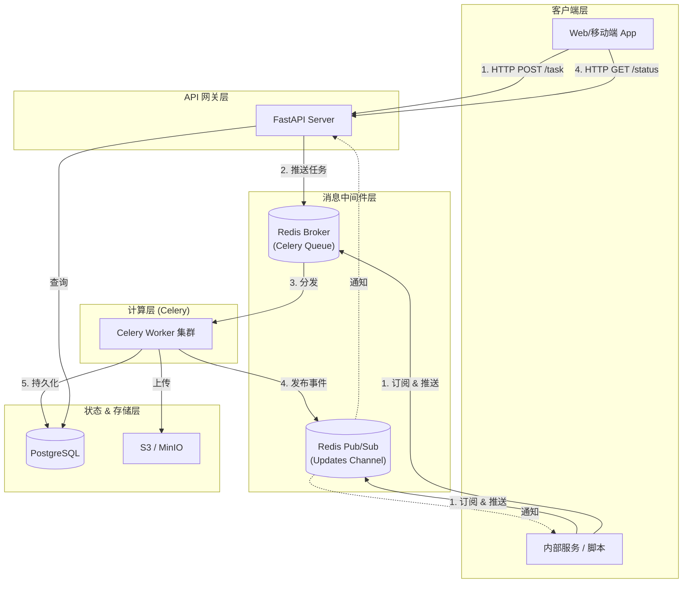
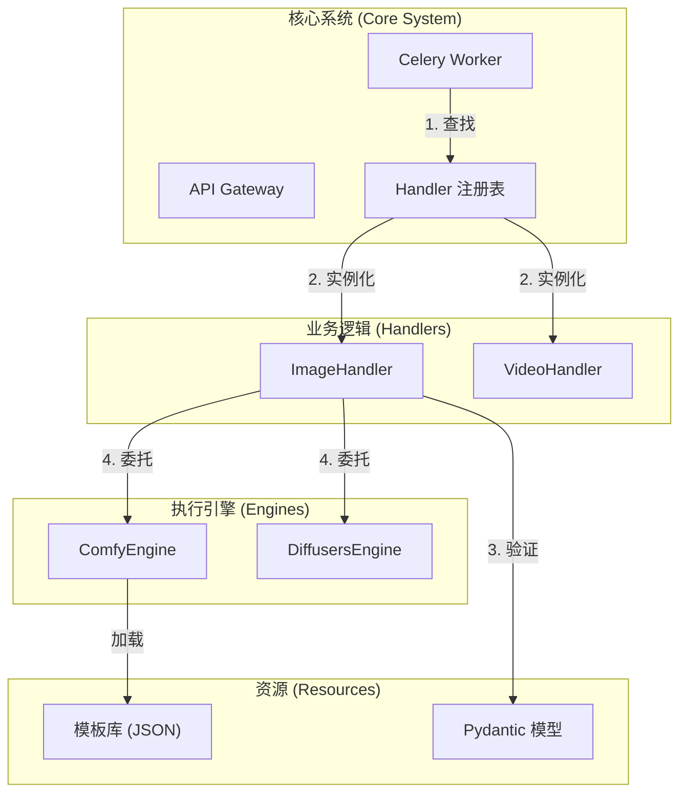
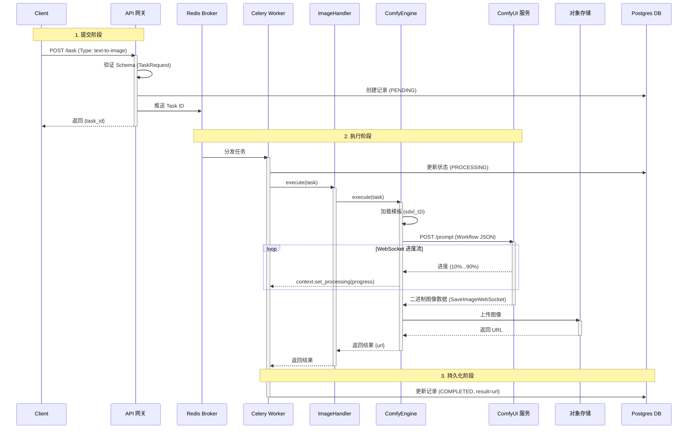

# GenPulse 后端架构设计

## 1. 系统架构概览

GenPulse 是一个支持多模态（图像/视频）和多执行引擎（ComfyUI/Diffusers/API）的高并发生成式 AI 后端系统。它采用**混合接入架构**，同时支持标准的 HTTP 轮询和高性能的直接 MQ 交互。

### 核心特性
- **插件化架构**：采用注册表模式，核心系统对具体业务逻辑无感知。添加新能力（如 TTS）只需添加一个 Handler 文件，无需修改核心。
- **混合通信**：支持 **HTTP+轮询**（立即响应+状态检查）和 **Redis MQ**（直接消息队列连接）接入。
- **统一执行抽象**：定义了标准的 `BaseHandler` 接口。无论是本地模型推理、ComfyUI 转发，还是外部 API 调用（如火山引擎、可灵），都被封装为统一的执行单元。
- **状态管理**：使用 PostgreSQL 进行持久化，Redis 用于实时状态和消息总线。
- **存储策略**：对象存储（OSS/S3）托管生成的资产，支持临时链接和 CDN 加速。

## 2. 系统拓扑图



## 3. 详细设计

### 3.1 核心：Handler-Client 架构

为了实现"无需修改即可扩展"，系统采用了分层的**注册表模式**。

**目录结构：**
```
src/genpulse/
  ├── app.py           # FastAPI应用工厂 & 网关
  ├── worker.py        # 通用任务 Worker (消费者)
  ├── handlers/        # 业务领域调度器 (The "What")
  │   ├── base.py      # BaseHandler 接口
  │   ├── registry.py  # 任务-Handler 映射
  │   ├── image.py     # 图像生成调度器 (T2I, I2I)
  │   └── video.py     # 视频生成调度器 (T2V, I2V)
  ├── clients/         # 外部 API 包装器 (The "Remote")
  │   ├── base.py      # BaseClient
  │   ├── comfyui/     # ComfyUI HTTP/WS 客户端
  │   ├── volcengine/  # 字节跳动火山引擎客户端
  │   ├── tencent/     # 腾讯云客户端
  │   ├── baidu/       # 百度云客户端
  │   ├── kling/       # 快手可灵客户端
  │   └── ...          
  ├── engines/         # 执行引擎 (The "How")
  │   ├── base.py      # BaseEngine 接口
  │   ├── comfy_engine.py    # ComfyUI 工作流执行器
  │   └── diffusers_engine.py # 本地 Diffusers 执行器
  ├── templates/       # 工作流模板
  │   └── comfy/       # ComfyUI JSON 模板
  ├── infra/           # 共享基础设施
  │   ├── database/    # PostgreSQL / SQLAlchemy
  │   └── mq/          # 消息队列抽象 (Celery)
```

**组件架构图:**



**请求生命周期分析 (时序图):**



**BaseHandler 接口：**
```python
class BaseHandler(ABC):
    @abstractmethod
    def validate_params(self, params: Dict[str, Any]) -> bool:
        """验证任务参数"""
        pass

    @abstractmethod
    async def execute(self, task: Dict[str, Any], context: TaskContext) -> Dict[str, Any]:
        """
        核心执行逻辑。
        Context 提供强类型的能力，如 `context.set_processing()`。
        """
        pass
```

### 3.2 统一任务模型 & Context

任务类型不再绑定到具体实现，而是代表用户想要做"什么"。具体"怎么做"通过 `provider` 参数指定。

**TaskContext**:
使用 `TaskContext` 对象代替原始字典，确保类型安全和一致的状态更新。

```python
@dataclass
class TaskContext:
    task_id: str
    update_status: Callable[...] 
    
    async def set_processing(self, progress: int, info: str = None): ...
    async def set_failed(self, error: str): ...
```

### 3.3 通用 Worker 逻辑

Worker 不包含领域特定逻辑；它仅作为桥梁：

1.  从 MQ 取出任务 (通过 `genpulse.infra.mq`)。
2.  读取 `task_type`。
3.  从 `genpulse.handlers.registry` 获取对应的 `FeatureHandler`。
4.  实例化并调用 `await handler.execute(task, context)`。
5.  Feature handler 委托给 `engines` 或 `clients`。
6.  捕获返回值或异常，更新 MQ/DB。

### 3.4 扩展场景

-   **场景：添加新的云提供商（例如 Sora）**
    1.  创建 `src/genpulse/clients/sora/`。
    2.  实现继承自 `BaseClient` 的 `SoraClient`。
    3.  在 `schemas.py` 定义 Schema。
    4.  更新 `src/genpulse/handlers/video.py`，将 `provider="sora"` 路由到新客户端。
    5.  **完成**。

-   **场景：添加新任务类型（例如 文本转音频）**
    1.  创建 `src/genpulse/handlers/audio.py`。
    2.  实现 `BaseHandler`。
    3.  添加装饰器 `@registry.register("text-to-audio")`。
    4.  **完成**。API 自动支持 `task_type="text-to-audio"`。

### 3.5 双模接入 (Dual-Mode Ingestion)

GenPulse 支持两种截然不同的交互模型，共享底层 GPU 基础设施：

**模式 A: HTTP + 轮询 ("服务员"模式)**
- **目标**: 公网 Web 应用, 移动 App, 前端。
- **流程**: 用户 POST task -> API 立即返回 ID -> 用户轮询 ID -> API 检查 Redis/DB。
- **优点**: 客户端非阻塞，抗网络抖动，标准 REST API。

**模式 B: RPC 微服务 ("直连"模式)**
- **目标**: 内部脚本, 微服务, CI/CD 流水线。
- **流程**: 服务调用 `mq.send_task_wait()` -> SDK 连接 Redis -> 推送任务 -> 订阅结果频道 -> 阻塞直到完成。
- **优点**: 类似同步调用的开发体验，吞吐量更高，无轮询延迟。

**共享基础设施**:
两种模式都将任务提交到**同一个 Celery Queue**。Worker 集群不区分来源；它只是处理任务并广播事件。这允许跨不同流量类型最大化资源利用率。

### 3.6 错误处理策略

1.  **检测**: Clients/Engines 抛出异常（包装后或标准异常）。
2.  **捕获**: Worker 将整个执行块包裹在健壮的 `try/except` 中。
3.  **报告**: 捕获异常后，Worker 自动：
    -   使用 `loguru` 记录完整堆栈跟踪。
    -   更新 MQ/DB 状态为 `FAILED`。
    -   传播错误信息。

## 4. 技术栈

| 组件 | 选择 | 原因 |
| :--- | :--- | :--- |
| **语言** | Python 3.10+ | AI 生态标准，优秀的类型提示支持 |
| **Web 框架** | **FastAPI** | 高性能异步，原生 OpenAPI 支持 |
| **队列 / Broker** | **Celery** (over Redis) | 健壮的分布式任务队列，有 ACK 保证 |
| **MQ 抽象** | **CeleryMQ** | Celery & Redis Pub/Sub 的 RPC 封装 |
| **数据库** | **PostgreSQL** | 健壮的关系型存储，支持 JSONB |
| **ORM** | **SQLAlchemy(Async)** | 现代异步 ORM |
| **HTTP 客户端** | **HTTPX** | 用于外部 API 调用的全异步 HTTP 客户端 |
| **验证** | **Pydantic V2** | 健壮的数据验证和设置管理 |
| **AI 推理** | **Diffusers** / **ComfyUI** | 行业标准的推理库 |
